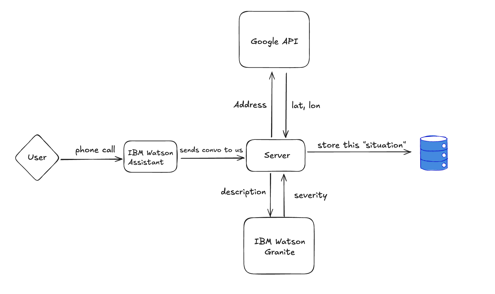

# AidLink
See our demo video here: https://www.youtube.com/watch?v=wFWTfRssFOg

## [AI Days 1st Place Winner 🥇](https://devpost.com/software/aidlink-isoz04)

Test the phone call by calling (646) 755-9391. Visit the app at https://aidays.vercel.app/.

The app serves two purposes:

1. You're able to create requests within the app. You can register and create a request and add your address.
2. You're able to create requests by calling the phone number and speaking to an AI agent about the resources you're in need of.

# Technology Decisions

The frontend components and backend API route were built in Next.js and hosted on Vercel. We chose Next.js 15 mainly due to development speed reasons, as the hackathon was limited to 48 hours. Vercel also made it easy to host our PostgreSQL database and easily integrate it with the Drizzle ORM in Next.js.

# Multidisciplinary

- Our CISE team members were responsible for system design. The tech stack was chosen exclusively for building speed, as the hackathon had a time limit of 48 hours.
- Our Statistics team members were Data Science majors who were responsible for maximizing the performance of AI models through prompt engineering. Alyssa's performance and the performance of our severity detection model (Watson AI Granite) improved significantly over the course of the hackathon.
- Our Economics team member developed a report that ensured we were minimizing costs and developing a platform that was feasible for large-scale deployments. The cost of hosting such a service and using IBM Watson products were analyzed in this report. This report will be shared during the Live pitch.
- Our Digital Worlds team member was able to develop UI/UX designs for our application and made use of not just manual design skills but also AI-powered design such as the use of v0.dev

# Diagrams

This is a diagram of how we store information after a user calls Alyssa.

